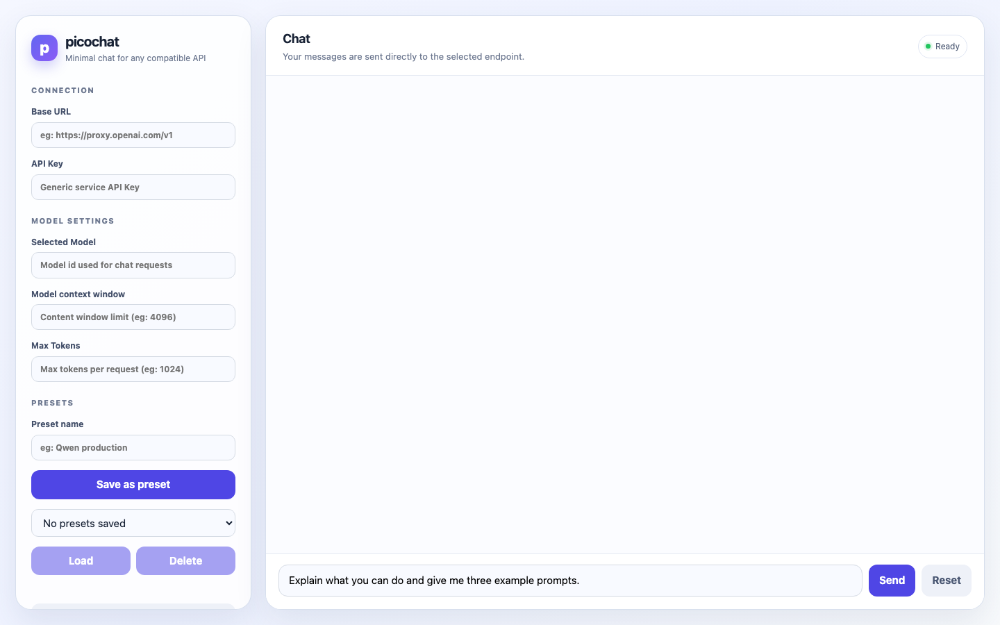
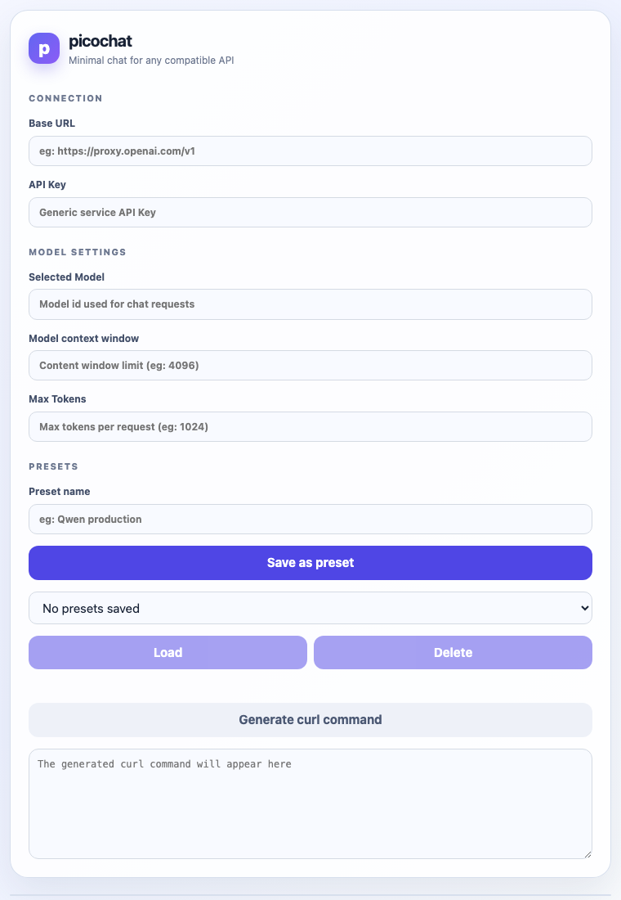

# picochat

Minimal browser chat client for any OpenAI-compatible API exposing a streaming `/chat/completions` endpoint. The entire app is contained in [`index.html`](index.html): there is no build step, backend, framework, or dependency installation.

## Run it

Open `index.html` directly in a browser, or serve the repository with any static HTTP server:

```bash
python3 -m http.server 8080
```

Then open <http://localhost:8080/>.

## Deploy with GitHub Pages

This repository includes a GitHub Actions workflow for Pages. To publish it:

1. Push the repository to GitHub with the default branch named `main`.
2. In **Settings → Pages**, set **Source** to **GitHub Actions**.
3. Push to `main`, or run **Deploy to GitHub Pages** manually from the **Actions** tab.

The workflow uploads the repository as a static site and publishes `index.html` at the generated Pages URL. No build or dependency installation is required. A custom domain can be configured later in **Settings → Pages**.

GitHub Pages only hosts the frontend. The browser still sends the API key directly to the Base URL entered by the user, so that endpoint must allow CORS requests from the Pages origin.

## Screenshots

Desktop layout with the connection, model, preset, and chat controls:



Responsive narrow layout for smaller screens:



## Configure a connection

Fill in the left-hand panel:

- **Base URL** — the API base, including `/v1` when required, such as `https://api.openai.com/v1`. picochat appends `/chat/completions` and removes trailing slashes.
- **API Key** — sent as `Authorization: Bearer …` directly from the browser.
- **Selected Model** — the model identifier sent in each request.
- **Model context window** — optional context limit used for local history fitting.
- **Max Tokens** — optional `max_tokens` value reserved from the context budget.

Configuration is saved in browser `localStorage` as `picochat.cfg.v1`. Recent values for each field are available from its dropdown and are stored under `picochat.hist.v1`. Saved presets are stored under `picochat.presets.v1`; up to 20 named presets are kept.

The API key never goes to a picochat server, but it is stored in this browser's local storage and sent to the endpoint you enter. Avoid using the app on a shared or untrusted browser.

## Chat behavior

Each request is stateless: picochat sends the complete conversation history to the selected endpoint. Requests have this shape:

```json
{
  "model": "your-model",
  "messages": [{"role": "user", "content": "Hello"}],
  "max_tokens": 1024,
  "stream": true
}
```

`max_tokens` is omitted when left blank. If a context window is configured, picochat estimates tokens at roughly four characters per token plus four tokens per message, reserves the max-token budget, and removes the oldest messages until the request fits. The newest message is always retained.

Responses are read as Server-Sent Events. `choices[0].delta.content` chunks are rendered as they arrive until `data: [DONE]`.

## Presets and curl output

Use **Save as preset** to store the current five connection settings. Select a preset to load or delete it. **Generate curl command** creates a reproducible non-streaming request for the current prompt and fitted history; the generated command is displayed in the page for copying.

## Errors and diagnostics

HTTP, network, CORS, DNS/TLS, and malformed-stream failures appear in the chat as an error message with request diagnostics. The user message remains queued so the next send retries it, while the incomplete assistant response is removed. Request details are also logged to the browser console with a `[picochat]` prefix. API keys are masked in diagnostics as `first8…last4` (or `(short key)`).

Click **Reset** to clear the conversation. It does not clear connection settings, history, or presets.

## Manual smoke test

1. Open the app and enter a compatible base URL, key, and model.
2. Send a prompt and verify that the assistant response appears incrementally.
3. Send a follow-up to verify multi-turn history.
4. Reload the page and confirm that settings and field histories remain.
5. Set a small context window and send several long messages to verify oldest-first truncation.
6. Try an invalid endpoint or key and confirm the diagnostic error bubble and retry behavior.

For offline testing, serve the app from a small mock server that returns SSE chunks from `POST /v1/chat/completions`:

```text
data: {"choices":[{"delta":{"content":"hello "}}]}

data: {"choices":[{"delta":{"content":"world"}}]}

data: [DONE]
```

## License

No license file is currently included in this repository.
